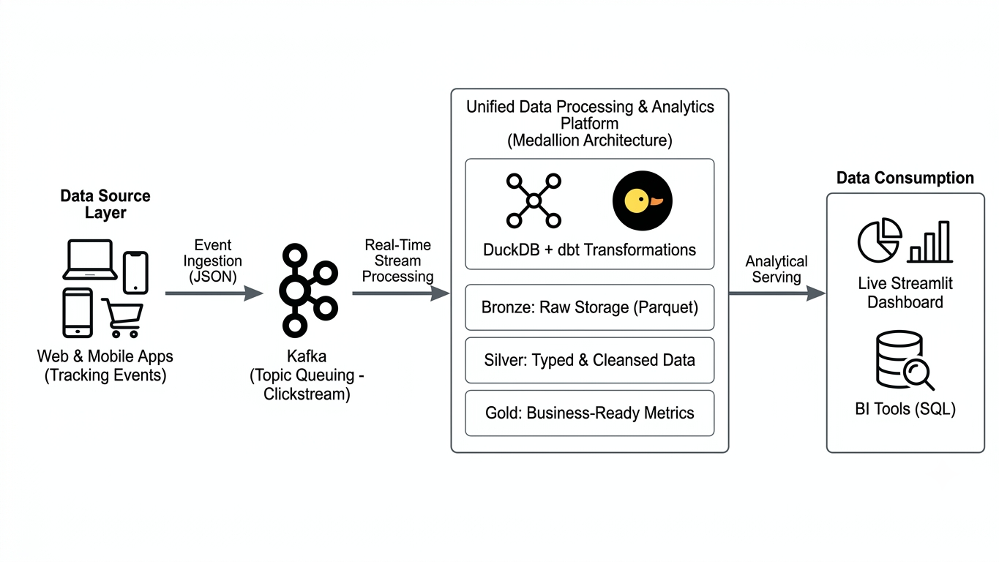
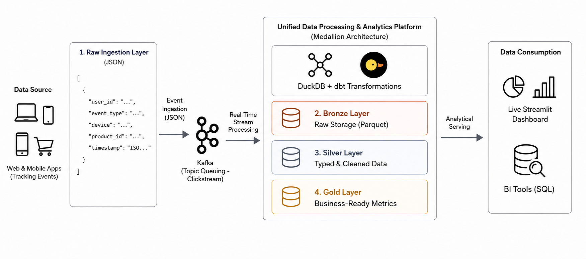

# Clickstream Pipeline | End-to-End Data Platform

## Introduction
Every time a user interacts with a digital product—whether clicking a button on a website, viewing a product page, or completing a purchase on a mobile app they leave a trail of digital footprints known as clickstream data. Understanding this data in real time allows businesses to instantly optimize user experiences, detect operational issues, and track customer engagement.

This project implements a fully automated, local data platform designed to capture, process, and analyze high-velocity event streams.

**For Non-Technical Teams:** It acts as an intelligent surveillance and analytics system. It automatically captures user actions the moment they happen, cleans up the messy raw data, organizes it into structured summaries, and displays live performance metrics on an interactive business dashboard.

**For Technical Teams:** It is a local end-to-end data pipeline built on a Medallion Architecture. It simulates event streams via a Python generator, queues incoming JSON payloads using Apache Kafka, and utilizes DuckDB and dbt to execute raw data ingestion (Bronze), deduplication/typing (Silver), and dimensional business aggregation (Gold)—all finalized by a live Streamlit serving layer.

## Architecture


## Technology Used
1. Scripting Language - SQL
2. Programming Language - Python
3. Framework - dbt, Streamlit
4. Core Architecture - DuckDB, Apache Kafka
5. Development Tool - VS Code
6. Infrastructure - Git, Github 

## Dataset Profile & Schema Example

This pipeline processes real-time behavioral data generated by users interacting with an application. It merges a continuous stream of live user actions with a static table of user profiles.

### 1. Raw Clickstream Event (JSON Payload)
This is the raw, unstructured payload generated by the Python simulator and sent directly to the Kafka topic. Every single click, purchase, or page view is captured as a JSON object:

```json
JSON
{
  "event_id": "8f3b2a5c-1d9e-4b7a-8f3c-9d8e7b6a5f4c",
  "user_id": 1042,
  "event_type": "purchase",
  "device": "Mobile",
  "product_id": 305,
  "timestamp": "2026-07-17T10:55:00.123Z"
}
```
### 2. User Profile (Static Dimension Table)
This represents the static demographic information stored in the database, allowing us to segment the incoming actions by user characteristics:

| Field | Type | Description | Example |
| :--- | :--- | :--- | :--- |
| `user_id` | INT (Primary Key) | Unique identifier for the user | `1042` |
| `registration_date` | DATE | The date the user created their account | `2025-11-12` |
| `preferred_device` | VARCHAR | The device they primarily log in with | `Mobile` |

### 3. Structured Analytical Output (Gold Layer View)
After the pipeline processes, deduplicates, and aggregates the raw data through the Medallion layers, it outputs clean, business-ready tables to power the Streamlit dashboard:

| Field | Type | Description | Example |
| :--- | :--- | :--- | :--- |
| `interaction_date` | DATE | The date the activity occurred | `2026-07-17` |
| `event_type` | VARCHAR | The specific user action recorded | `purchase` |
| `total_actions` | BIGINT | Total volume of events for this specific metric slice | `142` |
| `total_purchase_amount` | DECIMAL | Total revenue generated from purchase events | `$4,250.00` |
| `product_category` | VARCHAR | The category classification of the item or device channel | `Electronics` |

## The Medallion Pipeline Architecture

To transition data from unstructured, raw JSON payloads into clean, business-ready analytical dashboards, this platform implements a structured **Medallion Architecture** using **dbt** and **DuckDB**:
* **`Bronze Layer`** (Raw Ingestion): Serves as the immediate landing zone for incoming Kafka events. It captures the payloads in their native state, including a raw `JSONB` blob, preserving the original data for historical replay or troubleshooting.
* **`Silver Layer`** (Cleanse & Conform): Executes critical cleaning tasks to turn raw JSON into queryable relational tables by filtering out duplicate network transmissions using unique `event_id` keys, converting text strings into proper database types, and validating user identifiers.
* **`Gold Layer`** (Business Aggregations): Builds pre-aggregated, dimensional views to serve highly structured, lightning-fast analytical datasets to the end-user, computing metrics like Life-Time Value (LTV), conversion rates, and session durations.

## Data Transformation Models (dbt & DuckDB SQL)

These are the SQL implementation scripts managed by dbt that execute the structural transformations across our database layers.

### 1. Silver Cleaned Layer (`models/silver/silver_dim_users.sql`)
This layer processes the raw ingested components to enforce data integrity, handle type casting, and clear redundant records:

```sql
SQL
{{ config(materialized='table') }}

WITH raw_users AS (
    SELECT 
        CAST(user_id AS INT) AS user_id,
        TRY_CAST(registration_date AS DATE) AS registration_date,
        TRY_CAST(last_event_time AS TIMESTAMP) AS last_event_time,
        TRIM(preferred_device) AS preferred_device,
        GEN_RANDOM_UUID() AS user_uuid
    FROM {{ ref('bronze_dim_users') }}
)

SELECT DISTINCT * FROM raw_users
WHERE user_id IS NOT NULL

```
### 2. Gold Analytical Layer (models/gold/gold_fact_clickstream.sql)
This layer handles the final business logic and joins historical profile dimensions against operational data metrics to optimize analytical dashboard rendering:
```sql
SQL
{{ config(materialized='view') }}

WITH silver_events AS (
    SELECT * FROM {{ ref('silver_fact_clickstream') }}
),

silver_users AS (
    SELECT * FROM {{ ref('silver_dim_users') }}
)

SELECT 
    CAST(e.timestamp AS DATE) AS interaction_date,
    e.event_type,
    COUNT(e.event_id) AS total_actions,
    SUM(CASE WHEN e.is_purchase_event = TRUE THEN 59.99 ELSE 0.00 END) AS total_purchase_amount,
    COALESCE(u.preferred_device, e.device) AS product_category
FROM silver_events e
LEFT JOIN silver_users u ON e.user_id = u.user_id
GROUP BY 1, 2, 5
```
## Data Model


## Scripts for Project
1. **Extract:** [Python Event Generator Script](ingestion/generator.py)
2. **Load:** [DuckDB Target Store](ingestion/clickstream.db)
3. **Transform:** [dbt Models Directory](transform/models)

